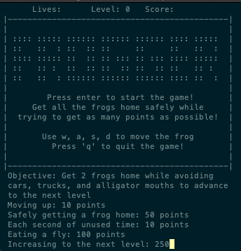

# Frogger

### Description ###
A recreation of the classic 1981 arcade game, Frogger, developed mainly in ARM Assembly Language and C. The objective of the game is to get all the frogs across the road and river to their home bases without getting hit by cars/trucks or falling into the water. 

### Installation ###
  * Install Code Composer Studio 8.3.1 (CCS)
      * Install TM4C12xARM Cortex-M4F-core-based MCUs for Product Families
  * Install Stellaris ICDI Drivers
  * TM4C123G LaunchPad Tiva C ARM Cortex-M4F MCU 32-Bit Embedded Evaluation Board
  
### Usage ###
Once you've installed all the necessary software and imported the project into CCS, plug in the board and turn it on. You can use PuTTy or the built-in terminal inside CCS to display the game interface. Upload the game onto the microcontroller and follow the prompts on the GUI to start the game. 

Enjoy!
